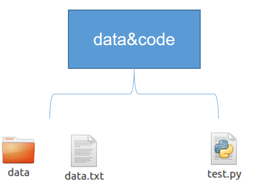
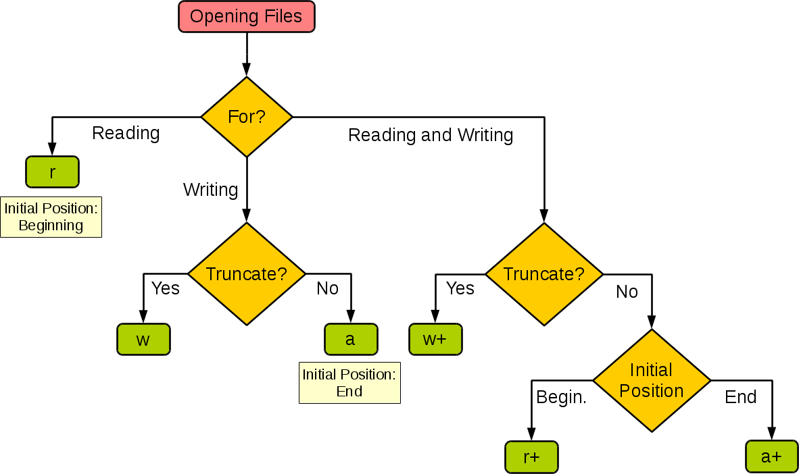

# Python文件操作

到目前为止，程序的代码和数据都混在一起，执行的时候再加载。更多的时候，我们希望将代码和数据分开，处理的数据单独保存，方便查看或是给他人使用



文件是数据持久化存储的方式之一

文件一般分为两种：文本文件和二进制文件。

简单说文本文件是可以打开阅读的，不能打开阅读的都是二进制文件。其实文本本质上也是二进制文件。

Python 提供了必要的函数和方法进行默认情况下的文件基本操作。

## open()方法

Python open() 方法用于打开一个文件，并返回文件对象，在对文件进行处理过程都需要使用到这个函数，如果该文件无法被打开，会抛出 OSError。

**注意：**使用 open() 方法一定要保证关闭文件对象，即调用 close() 方法。

open() 函数常用形式是接收两个参数：文件名(file)和模式(mode)。

`open(file, mode='r')`

完整的语法格式为：

`open(file, mode='r', buffering=-1, encoding=None, errors=None, newline=None, closefd=True, opener=None)`

参数说明：
*   file: 必需，文件路径（相对或者绝对路径）。
*   mode: 可选，文件打开模式
*   buffering: 设置缓冲
*   encoding: 一般使用utf8
*   errors: 报错级别
*   newline: 区分换行符
*   closefd: 传入的file参数类型
*   opener: 设置自定义开启器，开启器的返回值必须是一个打开的文件描述符。

mode 参数有：

| 模式 | 描述 |
| --- | --- |
| t | 文本模式 (默认)。 |
| x | 写模式，新建一个文件，如果该文件已存在则会报错。 |
| b | 二进制模式。 |
| + | 打开一个文件进行更新(可读可写)。 |
| U | 通用换行模式（**Python 3 不支持**）。 |
| r | 以只读方式打开文件。文件的指针将会放在文件的开头。这是默认模式。 |
| rb | 以二进制格式打开一个文件用于只读。文件指针将会放在文件的开头。这是默认模式。一般用于非文本文件如图片等。 |
| r+ | 打开一个文件用于读写。文件指针将会放在文件的开头。 |
| rb+ | 以二进制格式打开一个文件用于读写。文件指针将会放在文件的开头。一般用于非文本文件如图片等。 |
| w | 打开一个文件只用于写入。如果该文件已存在则打开文件，并从开头开始编辑，即原有内容会被删除。如果该文件不存在，创建新文件。 |
| wb | 以二进制格式打开一个文件只用于写入。如果该文件已存在则打开文件，并从开头开始编辑，即原有内容会被删除。如果该文件不存在，创建新文件。一般用于非文本文件如图片等。 |
| w+ | 打开一个文件用于读写。如果该文件已存在则打开文件，并从开头开始编辑，即原有内容会被删除。如果该文件不存在，创建新文件。 |
| wb+ | 以二进制格式打开一个文件用于读写。如果该文件已存在则打开文件，并从开头开始编辑，即原有内容会被删除。如果该文件不存在，创建新文件。一般用于非文本文件如图片等。 |
| a | 打开一个文件用于追加。如果该文件已存在，文件指针将会放在文件的结尾。也就是说，新的内容将会被写入到已有内容之后。如果该文件不存在，创建新文件进行写入。 |
| ab | 以二进制格式打开一个文件用于追加。如果该文件已存在，文件指针将会放在文件的结尾。也就是说，新的内容将会被写入到已有内容之后。如果该文件不存在，创建新文件进行写入。 |
| a+ | 打开一个文件用于读写。如果该文件已存在，文件指针将会放在文件的结尾。文件打开时会是追加模式。如果该文件不存在，创建新文件用于读写。 |
| ab+ | 以二进制格式打开一个文件用于追加。如果该文件已存在，文件指针将会放在文件的结尾。如果该文件不存在，创建新文件用于读写。 |

默认为文本模式，如果要以二进制模式打开，加上 b 。

下面这张图来自于[菜鸟教程](http://www.runoob.com/)网站，它展示了如果根据应用程序的需要来设置操作模式。


### 打开文件

```python
>>> f = open('linux.txt', 'r')
```

打开文件并取得文件对象之后，就可以利用文件对象的一些方法对文件进行读取、修改等操作。下表列举了平时常用的一些文件对象方法。


### 文件对象方法

|         文件对象的方法         |                                                                   执行的操作                                                                   |
| ---------------------------- | --------------------------------------------------------------------------------------------------------------------------------------------- |
| file.close()                 | 关闭文件。关闭后文件不能再进行读写操作。                                                                                                         |
| file.flush()                 | 刷新文件内部缓冲，直接把内部缓冲区的数据立刻写入文件, 而不是被动的等待输出缓冲区写入。                                                               |
| file.fileno()                | 返回一个整型的文件描述符(file descriptor FD 整型), 可以用在如os模块的read方法等一些底层操作上。                                                     |
| file.isatty()                | 如果文件连接到一个终端设备返回 True，否则返回 False。                                                                                             |
| file.next()                  | **Python 3 中的 File 对象不支持 next() 方法。**返回文件下一行。                                                                                  |
| file.read([size])            | 从文件读取指定的字节数，如果未给定或为负则读取所有。                                                                                              |
| file.readline([size])        | 从文件读取整行，包括 "\n" 字符。如果指定了一个非负数的参数，则返回指定大小的字节数，包括 "\n" 字符。                                                  |
| file.readlines([sizeint])    | 读取所有行并返回列表，若给定sizeint>0，返回总和大约为sizeint字节的行, 实际读取值可能比 sizeint 较大, 因为需要填充缓冲区。                             |
| file.seek(offset[, whence] ) | 移动文件读取指针到指定位置                                                                                                                      |
| file.tell()                  | 返回文件当前位置。                                                                                                                             |
| file.truncate([size])        | 从文件的首行首字符开始截断，截断文件为 size 个字符，无 size 表示从当前位置截断；截断之后后面的所有字符被删除，其中 windows 系统下的换行代表2个字符大小。 |
| file.write(str)              | 将字符串写入文件，返回的是写入的字符长度。                                                                                                        |
| file.writelines(sequence)    | 向文件写入一个序列字符串列表，如果需要换行则要自己加入每行的换行符。                                                                                |


### 关闭文件

**概述**

close() 方法用于关闭一个已打开的文件。关闭后的文件不能再进行读写操作， 否则会触发 ValueError 错误。 close() 方法允许调用多次。

当 file 对象，被引用到操作另外一个文件时，Python 会自动关闭之前的 file 对象。 使用 close() 方法关闭文件是一个好的习惯。

**语法**

```python
fileObject.close();
```

**参数**

* 无

**返回值**

该方法没有返回值。

**实例**

```python
# 打开文件
fo = open("example.txt", "w")
print("filename: ", fo.name)

# 关闭文件
fo.close(）
```

以上实例输出结果为：

```python
filename:  example.txt
```

### 文件读取和定位

文件的读取方法很多，可以使用文件对象的read()和readline()方法，也可以直接list(f)或者直接使用迭代来读取。read()是以字节为单位读取，如果不设置参数，那么会全部读取出来，文件指针指向文件末尾。tell()方法可以告诉你当前文件指针的位置：

刚才提到的文件指针是啥？可以认为它是一个“书签”，起到定位的作用。使用seek()方法可以调整文件指针的位置。seek(offset, from)方法有两个参数，表示从from（0代表文件起始位置，1代表当前位置，2代表文件末尾）偏移offset字节。因此将文件指针设置到文件起始位置，使用seek(0, 0)即可：

```python
>>> f.read()
'root:x:0:0:root:/root:/bin/bash\ndaemon:x:1:1:daemon:/usr/sbin:/usr/sbin/nologin\nbin:x:2:2:bin:/bin:/usr/sbin/nologin\nsys:x:3:3:sys:/dev:/usr/sbin/nologin\nsync:x:4:65534:sync:/bin:/bin/sync\ngames:x:5:60:games:/usr/games:/usr/sbin/nologin\nman:x:6:12:man:/var/cache/man:/usr/sbin/nologin\nlp:x:7:7:lp:/var/spool/lpd:/usr/sbin/nologin\nmail:x:8:8:mail:/var/mail:/usr/sbin/nologin\nnews:x:9:9:news:/var/spool/news:/usr/sbin/nologin\nuucp:x:10:10:uucp:/var/spool/uucp:/usr/sbin/nologin\nproxy:x:13:13:proxy:/bin:/usr/sbin/nologin\nwww-data:x:33:33:www-data:/var/www:/usr/sbin/nologin\nbackup:x:34:34:backup:/var/backups:/usr/sbin/nologin\nlist:x:38:38:Mailing List Manager:/var/list:/usr/sbin/nologin\nirc:x:39:39:ircd:/var/run/ircd:/usr/sbin/nologin\ngnats:x:41:41:Gnats Bug-Reporting System (admin):/var/lib/gnats:/usr/sbin/nologin\nnobody:x:65534:65534:nobody:/nonexistent:/usr/sbin/nologin\n_apt:x:100:65534::/nonexistent:/usr/sbin/nologin\nsystemd-timesync:x:101:102:systemd Time Synchronization,,,:/run/systemd:/usr/sbin/nologin\nsystemd-network:x:102:103:systemd Network Management,,,:/run/systemd:/usr/sbin/nologin\nsystemd-resolve:x:103:104:systemd Resolver,,,:/run/systemd:/usr/sbin/nologin\nmessagebus:x:104:110::/nonexistent:/usr/sbin/nologin\nsshd:x:105:65534::/run/sshd:/usr/sbin/nologin\nntp:x:106:112::/nonexistent:/usr/sbin/nologin\nsystemd-coredump:x:999:999:systemd Core Dumper:/:/usr/sbin/nologin\n_chrony:x:107:117:Chrony daemon,,,:/var/lib/chrony:/usr/sbin/nologin\ndemo:x:1000:1000:,,,:/home/demo:/bin/bash\n'
>>> f.tell()
1503
>>> f.seek(0, 0)
0
>>> f.read(10)
'root:x:0:0'
>>> f.tell()
10
>>> f.read(10)
':root:/roo'

```

readline()方法用于在文件中读取一整行，就是从文件指针的位置向后读取，直到遇到换行符（\n）结束：

```python
>>> f.seek(0, 0)
0
>>> f.readline()
'root:x:0:0:root:/root:/bin/bash\n'
```

```python
>>> f.seek(0, 0)
0
>>> for each_line in f:
...     print(each_line)

```

```python
# 打开文件
fo = open("example.md", "r",encoding="utf8")
print("filename: ", fo.name)

for line in fo.readlines():
    line = line.strip()
    print("data: %s" % line)

# 关闭文件
fo.close()
```

> 一个中文字符是三个字节，所以seek是要位移3的倍数。

**例：**

```python
fp = open('Shakespeare\'s sonnets') 
is_readable = fp.readable() # return True 
is_writable = fp.writable() # return False 
content = fp.read()
aline = fp.readline()
alllines = fp.readlines()
fp.close()
```

### 文件的写入

```python
>>> f = open('linux.txt', 'w')
>>> f.write('username')
8

>>> f.close()
>>> f = open('linux.txt')
>>> f.read()
'username'
```

**例：**

```python
fp1 = open('Shakespeare\'s connets', 'w')
print(fp1.readable()) # return False 
print(fp1.writable()) # return True 
romeo_and_juliet = """
ROMEO If I profane with my unworthiest hand This holy shrine, the gentle fine is this: My lips, two blushing pilgrims, ready stand To smooth that rough touch with a tender kiss.
""" 
fp1.write(romeo_and_juliet)
print(fp1.read()) #报错 
fp1.close()
```

### 文件flush()方法

**概述**

**flush()** 方法是用来刷新缓冲区的，即将缓冲区中的数据立刻写入文件，同时清空缓冲区，不需要是被动的等待输出缓冲区写入。

一般情况下，文件关闭后会自动刷新缓冲区，但有时你需要在关闭前刷新它，这时就可以使用 flush() 方法。

**语法**

flush() 方法语法如下[^1]：

fileObject.flush();

**参数
**
*   **无**
    

**返回值**

该方法没有返回值。

**实例**

```python
>>> fo = open("example.txt", "w")
>>> fo.write("linux")
5
>>> fo.flush()
>>> fo.close()
```

## OS模块

一个文件，除了其本身的内容以外，还有一些是系统操作，比如获取文件的属性，文件大小，文件创建时间，修改时间等，删除文件，文件重命名等，python内置的os模块提供了这些方法。

另外文件总是存在于某个目录下的，所以这两者经常在一起，都使用os模块提供的方法。

### 文件操作

判断文件是否存在
    os.path.exists(filename)
    
判断路径是否是一个文件
 os.path.isfile(filename)
 
获取文件的绝对路径
 os.path.abspath(filename)
 
获取文件大小
path = os.path.getsize(filename)

获取文件最后修改、访问时间
 os.path.getatime(filename)
 os.path.getmtime(filename)
 
比较两个文件是否相同
 os.path.samefile(filename, path)
 
重命名文件
os.rename(src，dst) #src是源文件名，dst是目标文件名

删除文件
  os.remove(filename)
  
### 目录操作

创建目录
os.mkdir(dirname)

创建多层目录
os.makedirs(dirname)

删除目录
os.rmdir(dirname)

删除多层目录
os.removedirs(dirname)

获取当前目录
os.getcwd() 

列出给定目录的文件和子目录
os.listdir(dirname)

判断是否是一个目录
os.path.isdir(path)

遍历目录下的文件
os.walk(dirname) 


**例：**

```python
import os
from os.path import join, getsize
# walk返回一个三元组可迭代对象，分别是上层目录，下层子目录和文件，然后逐层深入
for root, dirs, files in os.walk('python/Lib/email'):
    print(root, "consumes", end="")
    print(sum([getsize(join(root, name)) for name in files]), end="")
    print("bytes in", len(files), "non-directory files")
    if 'CVS' in dirs:
        dirs.remove('CVS')  # don't visit CVS directories
```

[^1]: https://python-markdown.github.io/extensions/
